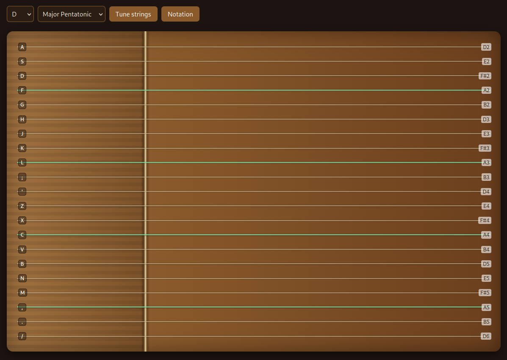

# Guzheng

A virtual guzheng that can be played in the browser. Includes the ability to change tunings and transcribe / play back using Jianpu notation



## Local Setup

```
npm install
npm run dev
```
